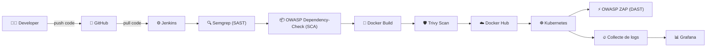

# 🛡️ Pipeline DevSecOps – CI/CD Sécurisé avec Jenkins

Projet **DevSecOps** intégrant la sécurité à chaque étape du pipeline CI/CD : du code source jusqu'au déploiement en production, avec scan de vulnérabilités, tests de sécurité automatisés et supervision en temps réel.

---

## 🎯 Concept du projet

L'objectif est d'intégrer la sécurité **à chaque étape** du cycle de vie applicatif (Shift Left Security), au lieu de la traiter uniquement en fin de chaîne. Le code est analysé, l'image Docker scannée, et l'application testée dynamiquement **avant et après** son déploiement — tout cela de manière automatisée via Jenkins.

Le pipeline repose sur 4 grandes phases :

1. **Code & SAST/SCA** 🔍
   Le développeur pousse son code sur GitHub. Jenkins récupère le code et lance :
   - **Semgrep** → analyse statique du code (SAST) pour détecter les failles de sécurité dans le code source
   - **OWASP Dependency-Check** → analyse de composition logicielle (SCA) pour détecter les vulnérabilités connues dans les dépendances

2. **Build & scan de l'image** 🐳
   - Construction de l'image **Docker**
   - Scan de vulnérabilités de l'image avec **Trivy**
   - Publication de l'image sur **Docker Hub**

3. **Déploiement & test dynamique** ☸️
   - Déploiement sur **Kubernetes**
   - **OWASP ZAP** exécute un test dynamique (DAST) sur l'application en cours d'exécution pour détecter les vulnérabilités exploitables en conditions réelles

4. **Supervision** 📊
   - Les logs/métriques sont collectés et envoyés vers **Grafana** pour le monitoring et la visualisation en temps réel du pipeline et de l'application déployée

---

## 🏗️ Architecture du pipeline

---

## 🛠️ Outils utilisés

| Étape | Outil | Rôle |
|---|---|---|
| Versioning | GitHub | Hébergement et gestion du code source |
| Orchestration CI/CD | Jenkins | Automatisation du pipeline |
| SAST | Semgrep | Analyse statique du code source |
| SCA | OWASP Dependency-Check | Détection de vulnérabilités dans les dépendances |
| Conteneurisation | Docker | Packaging de l'application |
| Scan d'image | Trivy | Analyse de vulnérabilités de l'image Docker |
| Registre | Docker Hub | Stockage et distribution des images |
| Orchestration conteneurs | Kubernetes (Minikube) | Déploiement de l'application |
| DAST | OWASP ZAP | Test de sécurité dynamique sur l'application déployée |
| Supervision | Grafana | Visualisation et monitoring |

---

## 📊 Résultats du pipeline (Stage View Jenkins)

Voici un exemple d'exécution réelle du pipeline (durée totale moyenne : **~5min 34s**) :

| Étape | Temps moyen |
|---|---|
| Declarative: Tool Install | 137ms |
| Clone | 1s |
| Build | 28s |
| SAST – Semgrep | 31s |
| SCA – OWASP Dependency-Check | 20s |
| Docker Build | 6s |
| Trivy Scan | 1min 16s |
| Push Docker Hub | 23s |
| Deploy to Minikube | 1s |
| DAST – OWASP ZAP | 41s |
| Declarative: Post Actions | 536ms |

> ✅ Chaque exécution du pipeline garantit que le code, l'image et l'application déployée sont passés par des contrôles de sécurité automatisés avant validation.

---

## 🔐 Pourquoi DevSecOps ?

Cette approche permet de :
- détecter les vulnérabilités **le plus tôt possible** (code, dépendances, image, runtime)
- éviter qu'une faille de sécurité atteigne la production
- automatiser la sécurité sans ralentir les cycles de livraison
- garder une **visibilité continue** sur l'état de sécurité de l'application via Grafana

---

